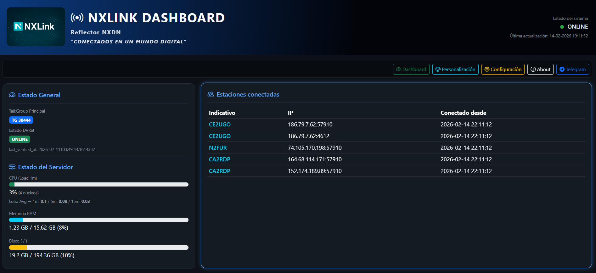
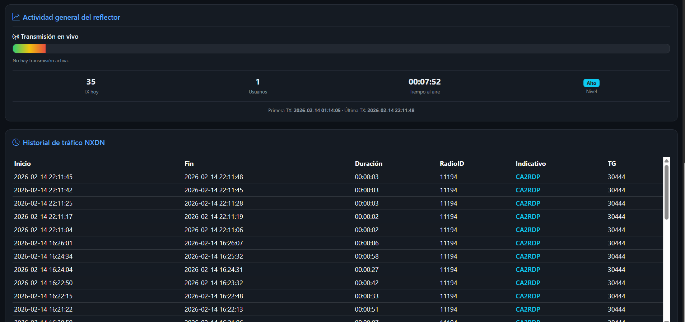

# 📡 NXLink Dashboard  
### Panel Web para NXDN Reflector  
Desarrollado por **Telecoviajero · CA2RDP**

---

## 🚀 Descripción

**NXLink Dashboard** es un panel web desarrollado para monitorear y administrar un reflector NXDN en tiempo real.

Permite visualizar:

- Estado del reflector
- Estaciones conectadas
- Actividad de transmisión
- Logs dinámicos
- VU-Meter en tiempo real
- Configuración básica del sistema
- Seguridad con autenticación
- Integración opcional con Telegram
- Selector de idioma

Diseñado para funcionar sobre servidores Linux (Debian / Ubuntu / Raspberry Pi / Banana Pi).

---

## DASHBOARD

## 🧠 ¿Para qué sirve?

Este dashboard permite a radioaficionados:

- Supervisar su reflector NXDN desde cualquier navegador
- Detectar actividad en tiempo real
- Monitorear logs automáticamente
- Gestionar configuraciones sin editar archivos manualmente
- Mejorar la presentación visual de su red digital

Ideal para:

- Redes comunitarias
- Reflectores personales
- Laboratorios de experimentación digital

---

## 🛠 Requisitos

- Linux (Debian recomendado)
- Apache2
- PHP 8.2 o superior
- Reflector NXDN funcionando, recomendado uso de reflector de NOSTAR
- Acceso a logs del reflector

Ejemplo de ruta de logs:
/var/log/nxdnreflector/NXDNReflector-YYYY-MM-DD.log

---

## 👉 [Ver instalacion](install.md) 

## 👉 [Ver cambios del sistema](CHANGELOG.md) 
- Chequea constantemente los cambios para que puedas tener tu NXLYNK optimizado y al dia

## 🤝 Créditos
- **Jonathan Naylor (G4KLX)** – base de software para reflectores/MMDVM.  
- **DVReflector de NØSTAR** – instalador de reflectores.
- **ZONA DMR CL** - apoyo continuo y pruebas de comunicaciones, gracias amigos 
- Comunidad internacional de radioaficionados digitales.  

## 🧑‍💻 Autor

CA2RDP - TelecoViajero
Radioaficionado, desarrollador autodidacta y creador de contenidos digitales:

* 🌐 GitHub: https://github.com/telecov
* 🌐 QRZ: https://www.qrz.com/db/CA2RDP
* 🔗 TikTok: https://tiktok.com/@telecoviajero
* 🔗 Instagram: https://instagram.com/telecoviajero
* 📺 YouTube: https://www.youtube.com/@Telecoviajero

## Te invito a suscribirte a miembros de youtube, tu aporte sin duda apoya a seguir creando 
https://www.youtube.com/channel/UCekZOnVxrOoDuJlFCgGKi9A/join

## Puedes Apoyar este proyecto de manera voluntaria
https://www.paypal.com/donate/?hosted_button_id=DGA8ADD7EA63Y

