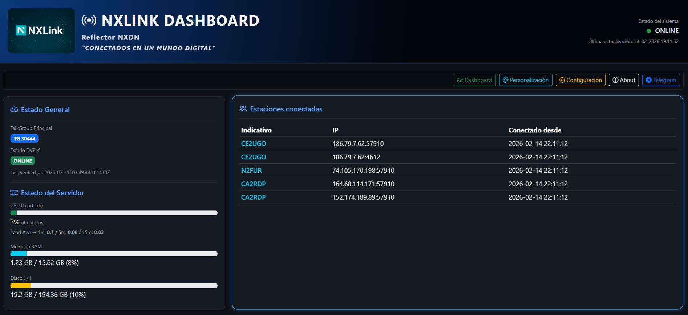
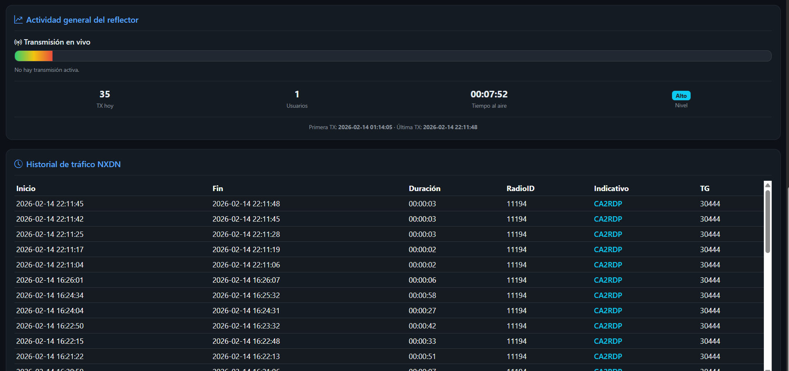

# 📡 NXLink Dashboard  

---

### 🌐 Web Panel for NXDN Reflector  
Developed by **Telecoviajero · CA2RDP**

---

## 🌍 Documentation

🌐 [Ver documentación en Español](README.md)  
🌐 [View documentation in English](README_EN.md)

---

## 🚀 Overview

**NXLink Dashboard** is a modern web panel designed to monitor and manage an NXDN reflector in real time.

It provides:

- 📡 Reflector status monitoring  
- 👥 Connected stations tracking  
- 🎙 Real-time transmission activity  
- 📜 Dynamic log visualization  
- 📊 Live VU Meter  
- ⚙️ Basic configuration panel  
- 🔐 Authentication security  
- 🤖 Optional Telegram integration  
- 🌐 Multi-language support  

---

## 📊 Preview

  

---

## 🎬 Video Presentation

[▶ Watch on YouTube](https://youtu.be/OhCTUfrEq38?si=tPsnN2qXmfsCvNVe)

---

## 🛠 Requirements

- Linux (Debian recommended)  
- Apache2  
- PHP 8.2 or higher  
- NXDN Reflector running (DVReflector by NØSTAR recommended)  
- Access to reflector logs  

---

## 📥 Installation

👉 [Installation Guide](install_en.md)

---

## 🔄 Changelog

👉 [View CHANGELOG](CHANGELOG.md)

⚠️ If your version differs, it is recommended to reinstall the dashboard.

---

## 🤝 Credits

- **Jonathan Naylor (G4KLX)** – Reflector / MMDVM base software  
- **DVReflector (NØSTAR)** – Reflector installer  
- **ZONA DMR CL** – Testing and support  
- Digital amateur radio community worldwide  

---

## 🧑‍💻 Author

**Telecoviajero · CA2RDP**  
Amateur radio operator, developer, and content creator  

- 🌐 GitHub: https://github.com/telecov  
- 🌐 QRZ: https://www.qrz.com/db/CA2RDP  
- 🎵 TikTok: https://tiktok.com/@telecoviajero  
- 📸 Instagram: https://instagram.com/telecoviajero  
- 📺 YouTube: https://www.youtube.com/@Telecoviajero  

---

## ❤️ Support the Project

If this project helps you, consider supporting it 🙌  

👉 Join YouTube Membership:  
https://www.youtube.com/channel/UCekZOnVxrOoDuJlFCgGKi9A/join  

❤️ Your support helps keep developing tools for the community.
https://www.paypal.com/donate/?hosted_button_id=MSJZZN9KLHNG6
---

## 📜 License

This project is licensed under the **GNU GPL v3 License**.
